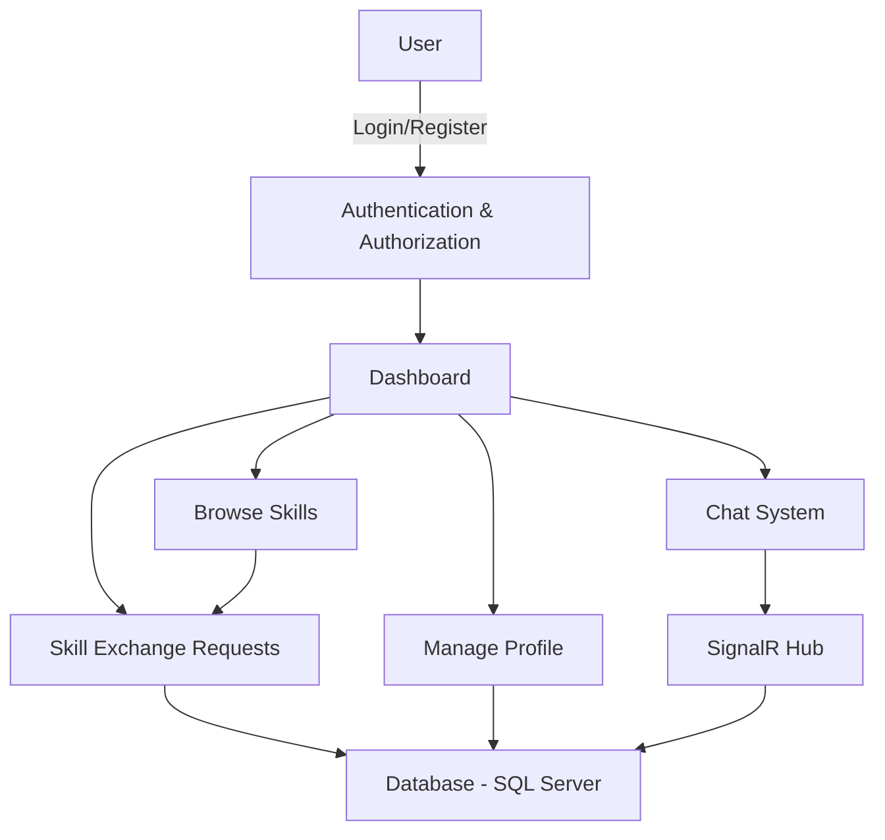

# SkillSwap App

A web application that enables users to **exchange skills and knowledge** with others in their community.

---

## Features
- **User Authentication & Authorization**
- **Real-time Chat** using SignalR
- **User Profile Management**
- **Skill Exchange System**
- **Responsive Web Design**

---

## Technology Stack
| Layer | Technology |
|-------|-----------|
| Backend | ASP.NET Core 3.1 |
| Frontend | HTML5, CSS3, JavaScript, jQuery |
| Database | SQL Server with Entity Framework Core 5.0 |
| Real-time | SignalR |
| Authentication | ASP.NET Core Identity |
| Architecture | MVC (Model-View-Controller) pattern |

---

## Flow Diagram


---

## Project Structure
```
SkillSwapApp/
├── Controllers/        # MVC Controllers
├── Data/               # Data context and database configuration
├── Models/             # Domain models
├── Repositories/       # Data access layer
├── ViewModels/         # View models
├── Views/              # Razor views
├── wwwroot/            # Static files (CSS, JS, images)
└── Hubs/               # SignalR hubs for real-time features
```

---

## Features in Detail

### User Authentication
- User registration and login  
- Password recovery  
- Role-based authorization  

### Skill Exchange
- Browse available skills  
- Request skill exchange  
- Manage your skill offers  

### Real-time Chat
- Instant messaging between users  
- Online/offline status  
- Message history  

---

## Getting Started

### Prerequisites
- [.NET Core 3.1 SDK](https://dotnet.microsoft.com/download/dotnet/3.1)  
- [SQL Server](https://www.microsoft.com/en-us/sql-server/sql-server-downloads) (Express or Developer edition)  
- [Visual Studio 2019](https://visualstudio.microsoft.com/vs/community/) or [Visual Studio Code](https://code.visualstudio.com/)  

### Installation
1. **Clone the repository**
```bash
git clone https://github.com/your-username/SkillSwapApp.git
cd SkillSwapApp
```
2. **Configure the database**  
- Update the connection string in `appsettings.json` with your SQL Server credentials  
- Run the following command in the Package Manager Console:
```powershell
Update-Database
```
3. **Run the application**
```bash
dotnet run
```
Or press **F5** in Visual Studio.

4. **Access the application**  
Open a web browser and navigate to:  
```
https://localhost:5001
```

---

## Contributing
1. Fork the repository  
2. Create your feature branch (`git checkout -b feature/AmazingFeature`)  
3. Commit your changes (`git commit -m 'Add some AmazingFeature'`)  
4. Push to the branch (`git push origin feature/AmazingFeature`)  
5. Open a Pull Request  
---

## Acknowledgments
- Built with **ASP.NET Core**  
- Uses **SignalR** for real-time features  
- Inspired by **community learning and skill-sharing platforms**

